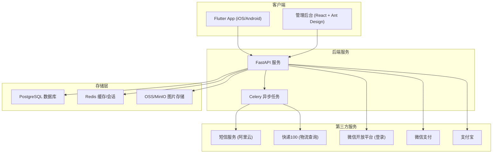
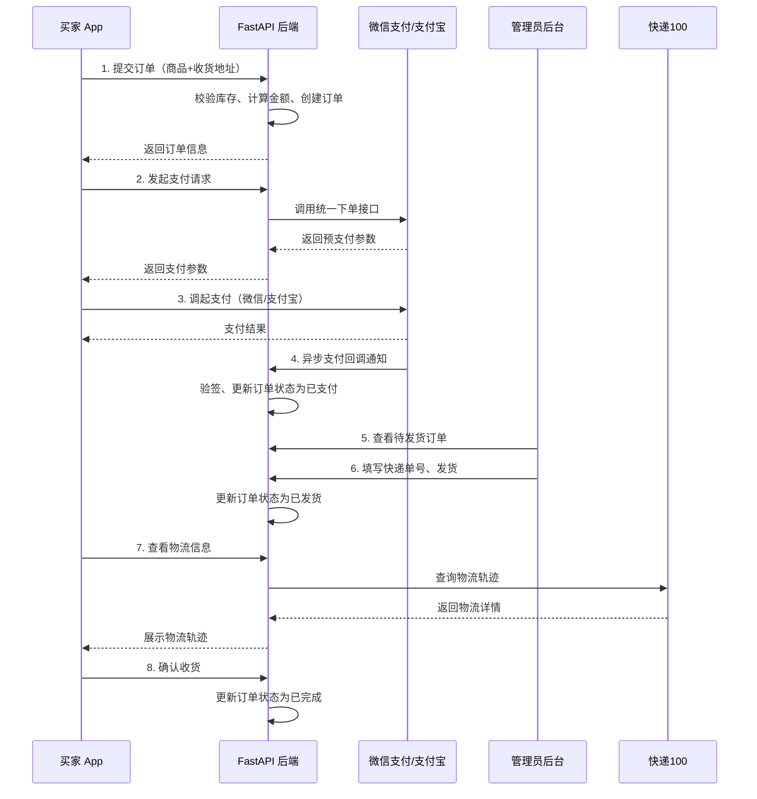
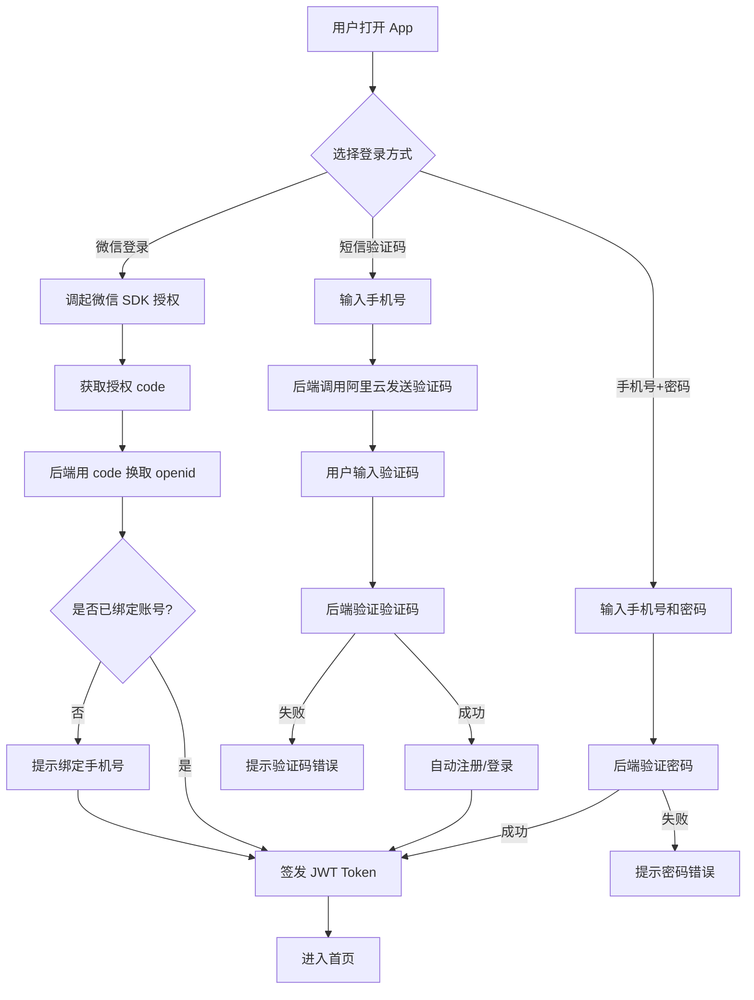
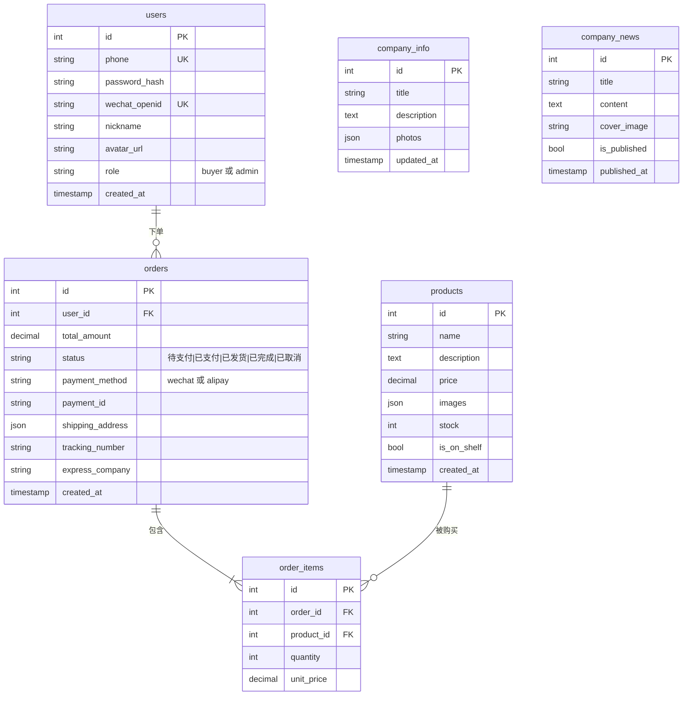
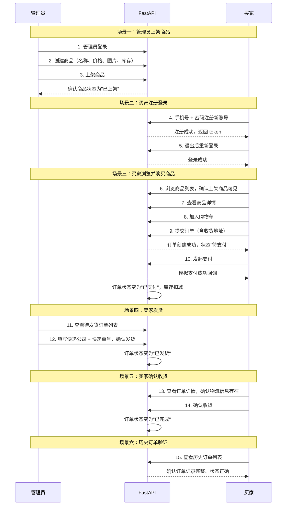

# 电商 App 全栈开发方案

## 本地开发环境准备

### 已具备

| 软件 | 当前版本 | 说明 |
|---|---|---|
| macOS | 26.3 | 系统满足要求 |
| Xcode | 26.3 | iOS 构建环境已就绪 |
| Git | 2.50 | 版本控制 |
| Node.js | 24.14 | React 管理后台开发 |
| npm | 11.9 | 前端包管理 |
| Homebrew | 5.0 | macOS 包管理器 |

### 阶段一前安装（后端开发）

**1. Docker Desktop** -- 运行 PostgreSQL、Redis、MinIO

```bash
brew install --cask docker
# 安装后打开 Docker Desktop 应用，等待启动完成
```

**2. Python 3.11+** -- 当前为 3.9.6，建议升级

```bash
brew install python@3.11
# 安装后确认版本
python3.11 --version
```

### 阶段三前安装（App 开发）

**3. Flutter SDK** -- 跨平台 App 开发框架

```bash
brew install --cask flutter
# 安装后检查环境
flutter doctor
```

**4. Android Studio** -- Android SDK、模拟器、Gradle 构建

```bash
brew install --cask android-studio
# 首次启动后按引导安装 Android SDK 和构建工具
# 设置 -> Plugins -> 安装 Flutter 和 Dart 插件
```

**5. Java JDK 17** -- Android 构建依赖

```bash
brew install openjdk@17
```

**6. CocoaPods** -- Flutter iOS 依赖管理

```bash
brew install cocoapods
```

### 环境验证

全部安装后运行以下命令确认：

```bash
docker --version          # Docker 已运行
python3.11 --version      # Python 3.11+
flutter doctor            # Flutter 环境检查（应全部打勾）
java --version            # JDK 17
pod --version             # CocoaPods
```

`flutter doctor` 会列出所有缺失项并给出修复指引，按提示操作即可。

### 可选推荐

- **Postman / Insomnia**：API 调试工具（也可直接用 FastAPI 自带的 Swagger UI `http://localhost:8000/docs`）
- **Android 真机调试**：手机开启"开发者选项" + "USB 调试"，数据线连接 Mac
- **iOS 真机调试**：需在 Xcode 中配置 Apple 开发者账号 + 信任证书

---

## 整体架构



## 用户下单支付流程



## 用户认证流程



## 技术栈

- **移动端 App**：Flutter 3.x (Dart)，一套代码同时支持 iOS + Android
- **后端 API**：Python 3.11+ / FastAPI + SQLAlchemy 2.0 + Alembic（数据库迁移）
- **管理后台**：React 18 + TypeScript + Ant Design 5 + Vite
- **数据库**：PostgreSQL 15
- **缓存**：Redis 7
- **图片存储**：MinIO（开发环境）/ 阿里云 OSS（生产环境）
- **异步任务**：Celery + Redis（短信发送、推送通知、物流追踪）
- **容器化**：Docker + docker-compose（本地开发环境）

## 项目目录结构

```
share_something/
├── backend/                  # FastAPI 后端
│   ├── app/
│   │   ├── main.py           # FastAPI 入口
│   │   ├── core/             # 配置、安全、依赖注入
│   │   ├── models/           # SQLAlchemy 数据模型
│   │   ├── schemas/          # Pydantic 请求/响应模型
│   │   ├── api/              # 路由处理
│   │   │   ├── v1/
│   │   │   │   ├── auth.py         # 登录/注册/短信/微信
│   │   │   │   ├── company.py      # 公司信息/新闻/照片
│   │   │   │   ├── products.py     # 商品 CRUD
│   │   │   │   ├── orders.py       # 订单生命周期
│   │   │   │   ├── payments.py     # 微信/支付宝回调
│   │   │   │   └── admin.py        # 管理员接口
│   │   ├── services/         # 业务逻辑层
│   │   ├── integrations/     # 微信、支付宝、短信、物流 SDK 对接
│   │   └── tasks/            # Celery 异步任务
│   ├── alembic/              # 数据库迁移
│   ├── tests/                # pytest 测试
│   ├── requirements.txt
│   └── Dockerfile
├── admin-web/                # React 管理后台
│   ├── src/
│   │   ├── pages/            # 仪表盘、商品、订单、公司信息、用户
│   │   ├── components/       # 通用组件
│   │   ├── services/         # API 请求封装
│   │   └── stores/           # zustand 状态管理
│   ├── package.json
│   └── Dockerfile
├── mobile/                   # Flutter App
│   ├── lib/
│   │   ├── main.dart
│   │   ├── models/           # 数据模型
│   │   ├── screens/          # 页面
│   │   │   ├── home/         # 公司展示首页
│   │   │   ├── products/     # 商品列表与详情
│   │   │   ├── cart/         # 购物车
│   │   │   ├── orders/       # 订单历史与物流追踪
│   │   │   ├── auth/         # 登录/注册
│   │   │   └── admin/        # App 内管理员页面
│   │   ├── providers/        # Riverpod 状态管理
│   │   ├── services/         # API 封装、支付、微信 SDK
│   │   └── widgets/          # 可复用 UI 组件
│   └── pubspec.yaml
├── docker-compose.yml        # PostgreSQL, Redis, MinIO, 后端, 管理后台
└── doc_auto/                 # 自动生成的文档
```

## 数据库设计（核心表）



## 功能模块拆解

### 模块 0：公司展示

- **接口**：`GET /api/v1/company/info`（公司简介）、`GET /api/v1/company/news`（新闻列表）
- **管理后台**：编辑公司简介、上传照片、发布/管理新闻动态
- **App 端**：首页展示公司横幅、照片轮播、新闻动态列表

### 模块 1：商品管理

- **接口**：完整 CRUD `GET/POST/PUT/DELETE /api/v1/products`，图片上传 `POST /api/v1/upload`
- **管理后台**：商品列表（支持上架/下架切换）、批量操作、图片拖拽上传
- **App 端**：商品网格列表、详情页（图片轮播、价格展示、商品介绍）

### 模块 2：用户认证

- **手机号 + 密码**：`POST /api/v1/auth/register`（注册）、`POST /api/v1/auth/login`（登录）
- **手机号 + 短信验证码**：`POST /api/v1/auth/sms/send`（发送验证码）、`POST /api/v1/auth/sms/verify`（验证登录），集成阿里云短信服务
- **微信登录**：`POST /api/v1/auth/wechat`，对接微信开放平台 SDK，移动端 OAuth 授权流程
- 基于 JWT 的认证机制，支持 refresh token 自动续期

### 模块 3：支付与订单

- **微信支付**：Flutter 端通过 `fluwx` 插件发起支付 + 后端统一下单接口
- **支付宝**：Flutter 端通过 `tobias` 插件发起支付 + 后端支付宝 SDK 对接
- **订单流程**：创建订单 -> 支付 -> 卖家发货（管理员更新快递信息）-> 买家确认收货
- **支付回调**：`POST /api/v1/payments/wechat/notify`、`POST /api/v1/payments/alipay/notify`
- **物流查询**：对接快递100 API 实时查询物流状态，通过 Celery 推送物流更新通知

### 管理后台（Web + App 内）

- **Web 端**：完整管理仪表盘 `admin-web/`，管理员账号登录，管理所有模块
- **App 内**：Flutter 内置简化版管理页面（当用户角色为 `admin` 时可见），支持商品管理、订单处理、公司信息更新

## 实施阶段

按依赖关系排序：先搭建后端核心，然后前端对接消费接口，最后集成支付（需要商户账号）。每个阶段必须完成对应的测试，全部通过后才能进入下一阶段。

### 阶段一：后端基础

**开发内容**：
- 项目脚手架搭建（FastAPI、Docker、PostgreSQL、Redis）
- 数据库模型设计 + Alembic 迁移脚本
- 认证系统（手机号注册/登录、JWT 令牌）

**测试要求**：
- 单元测试：用户注册（正常/重复手机号/无效格式）
- 单元测试：用户登录（正确密码/错误密码/不存在用户）
- 单元测试：JWT 签发与验证（有效 token/过期 token/无效 token）
- 单元测试：refresh token 续期机制
- 集成测试：数据库连接、Alembic 迁移 up/down 正确执行
- 测试覆盖率目标：>= 85%

### 阶段二：核心 API + 管理后台

**开发内容**：
- 公司信息和新闻 CRUD 接口
- 商品 CRUD 接口 + 图片上传
- React 管理后台（商品/公司信息/用户管理）

**测试要求**：
- 单元测试：公司信息 CRUD（创建/读取/更新）
- 单元测试：新闻 CRUD（发布/编辑/删除/分页查询）
- 单元测试：商品 CRUD（创建/编辑/上架/下架/删除/列表筛选）
- 单元测试：图片上传（正常上传/文件类型校验/大小限制）
- 单元测试：权限控制（管理员可操作/普通用户被拒绝）
- 集成测试：管理后台 API 联调（通过 API 客户端模拟管理员操作）
- 测试覆盖率目标：>= 85%

### 阶段三：Flutter App（买家端）

**开发内容**：
- App 脚手架搭建（Riverpod 状态管理、go_router 路由）
- 认证页面（登录、注册、短信验证码、微信登录）
- 公司展示首页
- 商品列表和详情页面
- 购物车

**测试要求**：
- Flutter Widget 测试：登录/注册页面表单校验与交互
- Flutter Widget 测试：商品列表渲染、下拉刷新、加载更多
- Flutter Widget 测试：商品详情页展示、加入购物车
- Flutter Widget 测试：购物车增删改查、数量修改、金额计算
- 单元测试：API Service 层（mock HTTP，验证请求/响应解析）
- 单元测试：Riverpod Provider 状态管理逻辑
- 集成测试：App 启动 -> 登录 -> 浏览商品 -> 加入购物车 完整链路

### 阶段四：订单与支付

**开发内容**：
- 订单创建与管理接口
- 微信支付 + 支付宝后端集成
- Flutter 支付功能集成（fluwx、tobias）
- 订单历史和物流追踪页面
- 管理员订单管理（Web + App）

**测试要求**：
- 单元测试：订单创建（正常/库存不足/商品已下架）
- 单元测试：订单状态机流转（待支付->已支付->已发货->已完成->已取消，非法流转被拒绝）
- 单元测试：支付回调验签（微信/支付宝签名校验，防篡改，防重放）
- 单元测试：支付超时自动取消订单
- 单元测试：库存扣减与回滚（支付成功扣库存、取消订单恢复库存）
- 单元测试：物流信息更新与查询
- 集成测试：模拟支付回调通知，验证订单状态正确变更
- 集成测试：管理员发货流程（填写快递单号 -> 订单状态更新 -> 买家可查询物流）
- 测试覆盖率目标：>= 90%（支付模块属于核心链路，要求更高）

### 阶段五：完善与部署

**开发内容**：
- 短信验证服务集成（阿里云短信）
- 微信 OAuth 移动端登录对接
- 推送通知
- App 内管理员功能页面
- 异常处理、加载状态、分页
- Docker 生产环境配置

**测试要求**：
- 单元测试：短信发送（mock 阿里云 SDK，验证调用参数、频率限制、验证码过期）
- 单元测试：微信 OAuth 流程（mock 微信 API，code 换 openid，绑定/新建用户）
- 单元测试：推送通知发送逻辑
- 集成测试：App 内管理员页面功能（商品管理、订单处理）
- 异常场景测试：网络超时、服务不可用、数据库连接断开的优雅降级

### 阶段六：端到端全流程验收测试

完成所有开发后，执行完整的端到端测试，模拟真实业务场景。

**全流程测试场景**：



**具体测试用例清单**：

1. **管理员上架商品**
   - 管理员登录后台
   - 创建商品（含名称、描述、价格、库存、多张图片）
   - 上架商品，验证商品在买家端可见
   - 下架商品，验证商品在买家端不可见
   - 重新上架，继续后续流程

2. **买家注册与登录**
   - 手机号 + 密码注册
   - 退出后用手机号 + 密码登录
   - （如已对接）短信验证码登录
   - （如已对接）微信授权登录
   - 验证未登录时无法下单

3. **买家浏览与购买**
   - 浏览商品列表，搜索/筛选
   - 查看商品详情（图片、价格、介绍）
   - 加入购物车，修改数量
   - 提交订单，填写收货地址
   - 验证库存不足时下单被拒绝

4. **支付流程**
   - 模拟微信支付回调，验证订单状态变为"已支付"
   - 模拟支付宝回调，验证订单状态变为"已支付"
   - 验证重复回调不会重复扣库存（幂等性）
   - 验证支付超时订单自动取消，库存恢复

5. **卖家发货**
   - 管理员查看待发货订单
   - 填写快递公司和快递单号
   - 确认发货，订单状态变为"已发货"
   - 买家端可查看物流信息

6. **买家确认收货**
   - 买家确认收货，订单状态变为"已完成"
   - 查看历史订单列表，验证所有订单记录完整
   - 验证订单详情中金额、商品信息、物流信息均正确

7. **异常场景**
   - 并发下单同一商品（验证库存不会超卖）
   - 支付过程中商品被下架（订单正常完成）
   - 网络中断重试（接口幂等性）

---

## 常见问题 (FAQ)

### Q: 运行期间手机浏览器需要一直开着吗？

**不需要。** Flutter App 是编译为 iOS/Android **原生二进制**的移动应用，不是 H5/网页应用。安装后它作为独立 App 运行（和微信、淘宝一样），与手机浏览器无关。

项目中只有 **管理后台 (`admin-web/`)** 是 React 网页应用，管理员需要通过浏览器（桌面或手机均可）访问。

### Q: 可以在云端运行吗？

**可以。** 项目的三个组成部分各自的部署方式如下：

| 组件 | 运行位置 | 说明 |
|---|---|---|
| **后端服务** (FastAPI + PostgreSQL + Redis + MinIO) | ✅ 云服务器 | 使用 `docker-compose.prod.yml` 一键部署，支持阿里云 ECS、腾讯云 CVM 等任意 Linux 云服务器 |
| **管理后台** (React Web) | ✅ 云服务器 | 随后端一起部署，通过 Nginx 反向代理对外提供服务，管理员在任意设备浏览器中访问 |
| **Flutter App** (iOS/Android) | 📱 用户手机 | 编译打包后发布到 App Store / 各应用商店，用户下载安装后通过网络连接云端 API |

**云端部署步骤概览**：

1. 准备一台云服务器（推荐 2核4G 起步），安装 Docker + Docker Compose
2. 将项目代码上传至服务器
3. 配置 `.env` 文件（数据库密码、MinIO 密钥、支付密钥等）
4. 运行生产环境启动命令：
   ```bash
   docker compose -f docker-compose.yml -f docker-compose.prod.yml up -d --build
   ```
5. 后端 API 和管理后台将通过 Nginx 在 80 端口对外提供服务
6. 修改 Flutter App 中的 API 地址指向云服务器域名/IP，重新编译发布
